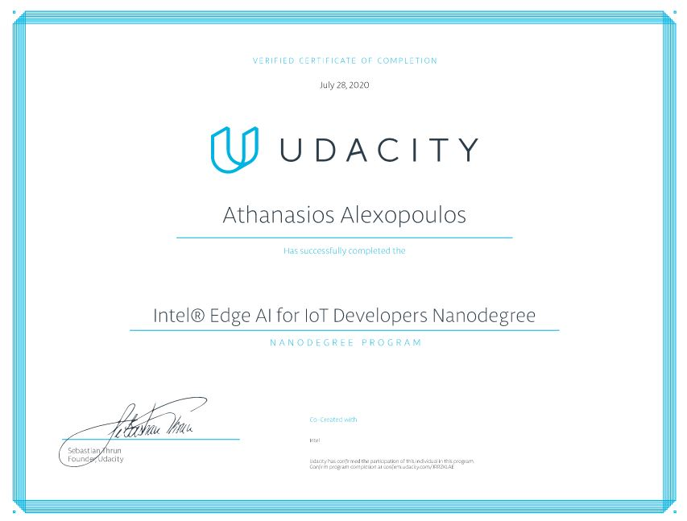

## What to find here
In this repo there are my implemetations regarding the "Intel® Edge AI for IoT Developers Nanodegree" program, provided by Udacity. Each project has it's own file, and contains a seperate readme, as per instuctions.

  
The link to the certification can be found [here](https://confirm.udacity.com/JRRZKLAE).